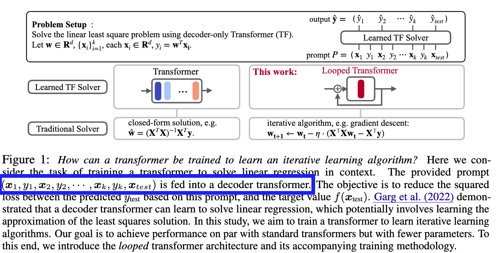
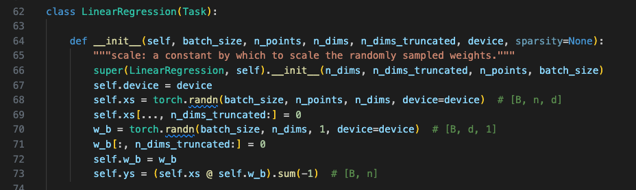
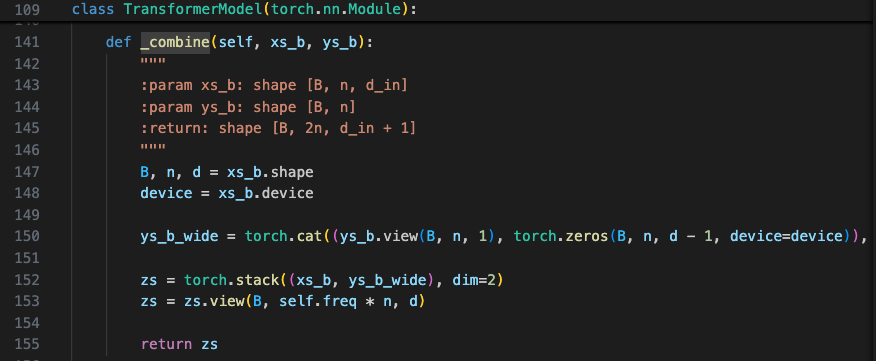

# Looped Transformers are Better at Learning Learning Algorithms (разбор статьи)

https://arxiv.org/abs/2311.12424

**Резюме**: код авторов статьи заставляет усомниться в работоспособности идеи.

## Проблемы в коде

В ходе разбора я нашел две серьезные проблемы в коде экспериментов.

**В промт подается $y_{test}$**

По задумке на вход трансформера должна подаваться последовательность $(x_1, y_1, \cdots, x_{test})$:



По факту же при обучении подается другая последовательность: $(x_1, y_1, \cdots, x_{test}, y_{test})$. 

Это проверяется в двух местах: при генерации данных и в самой модели. Там иксы просто стэкаются с таргетом (xs, ys) без удаления $y_{test}$.





**Модель тестируется на трейн-данных**

А еще при использовании сгенерированного датасета, авторы тестирую качество на том же батче, который до этого прогнали через цикл обучения.

На мой взгляд, тут налицо случай капитального переобучения в ключевом эксперименте.

## Выводы и следующие шаги

Зацикленный трансформер выглядит перспективно, но его экспериментальное подтверждение оставляет желать лучшего. В принципе, это все поправимо — я уже разобрался в идее и отрефакторил код из статьи, нужно только немного поправить логику эксперимента и запустить обучение. К сожалению, на последний шаг уже совсем не хватает времени.

Итого за эти выходные:

- [x] Вникнуть в статью
- [x] Отрефакторить код из статьи 
- [x] Найти идею для проверки 
- [ ] Закодить правильный экспермент и посмотреть метрики

## Как запустить обучение?

```
# Опционально
python3.10 -m venv .venv
source .venv/bin/activate

# Поставить зависимости и запустить обучение
pip install -r requrements.txt
python main.py
```

Простестировано:
* Ubuntu 22.04.4 LTS
* Python 3.10
* Nvidia T4
